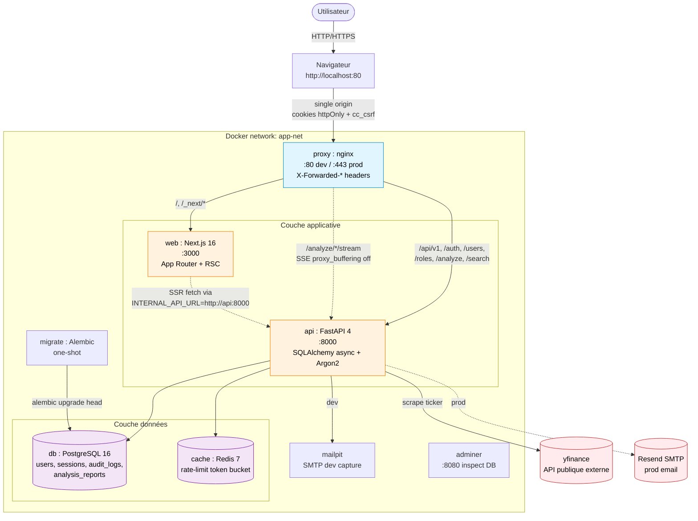
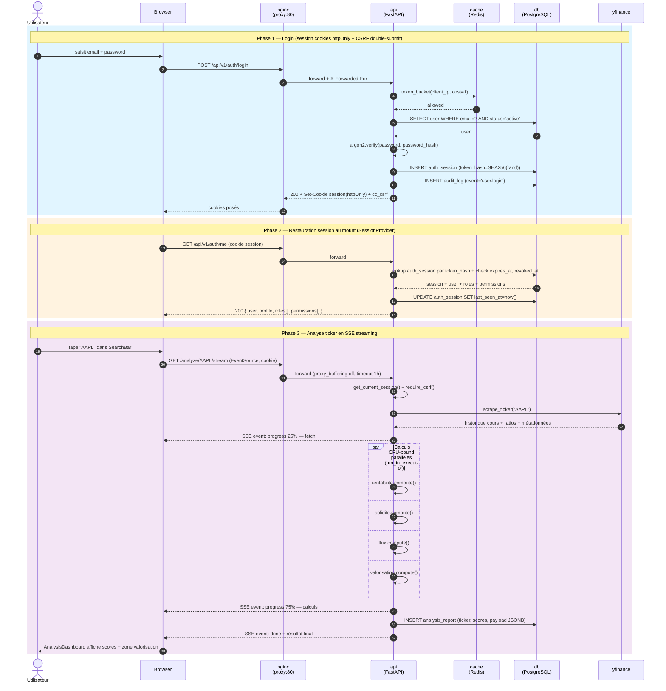

# Architecture STOX

App mobile d'analyse boursière pour débutants français — résumé visuel de la stack et des flux principaux.

## Vue d'ensemble

**STOX** est une stack Docker à **single origin** : le navigateur ne parle qu'à **nginx** (port 80 dev / 443 prod), qui route en interne vers Next.js ou FastAPI sur le réseau `app-net`.

| Couche | Composant | Rôle |
|---|---|---|
| Edge | **nginx** (`proxy`) | Reverse proxy, TLS prod, routage path-based, X-Forwarded-* |
| Frontend | **Next.js 16** (`web`) | App Router, React 19, Tailwind 4, cookies httpOnly + CSRF double-submit |
| Backend | **FastAPI 4** (`api`) | Auth session-based (Argon2 + SHA256), `/api/v1/*` + `/analyze/*` legacy |
| Données | **PostgreSQL 16** + **Redis 7** | ORM async (asyncpg) ; rate-limit token bucket Lua par IP |
| Migrations | **Alembic** (`migrate`) | One-shot, 3 migrations |
| Dev tooling | **Mailpit** + **Adminer** | Capture SMTP + inspecteur DB |
| Externe | **yfinance** | Scraping cours, ratios (P/E, ROE, ROA, marges, CAGR) |

**Domaines fonctionnels** :

- **Auth & RBAC** : User / Profile / Role / Permission, sessions DB hashées, email verification + password reset
- **GDPR** : self-delete, export JSON, audit trail (`audit_logs` + enum `audit_event_type`)
- **Analyse boursière** : 4 modules CPU-bound parallélisés via `run_in_executor` (rentabilité, solidité, flux, valorisation) → score global + zone valorisation, persistés en `analysis_reports` (JSONB)

---

## Diagramme d'architecture

**À retenir** :

- Dev : ports `3000`, `8000`, `5432`, `8080`, `8025` exposés au host pour debug, mais le front appelle en URL **relative** via nginx (`NEXT_PUBLIC_API_URL` vide).
- Prod : seuls **80 + 443** du proxy sont exposés ; le reste reste confiné à `app-net`.
- `INTERNAL_API_URL=http://api:8000` n'est utilisé **que côté serveur Next.js** (RSC/SSR) — voir [frontend/lib/config.ts](frontend/lib/config.ts).

---

## Diagramme de séquence — login + analyse ticker

---

## Points de friction critiques

1. **Rate-limit + IP réelle** (étape 4) — nginx doit envoyer `X-Forwarded-For` **ET** FastAPI doit tourner avec `--proxy-headers --forwarded-allow-ips=*`. Sinon tout le trafic apparaît comme venant de l'IP du conteneur `proxy` et un seul user sature le bucket pour tous.
2. **Idle session** (étape 14) — `last_seen_at` n'est mis à jour que si `idle_expires_at` n'est pas dépassé ; sinon `revoked_at` posé et 401.
3. **SSE buffering** (Phase 3) — nginx **doit** avoir `proxy_buffering off` et un timeout long (1h dans [nginx/nginx.dev.conf](nginx/nginx.dev.conf)) sinon le streaming ne marche pas.

---

## Fichiers de référence

| Sujet | Fichier |
|---|---|
| Routing nginx | [nginx/nginx.dev.conf](nginx/nginx.dev.conf), [nginx/nginx.prod.conf](nginx/nginx.prod.conf) |
| Compose | [docker-compose.yml](docker-compose.yml), [docker-compose.prod.yml](docker-compose.prod.yml) |
| Endpoints auth | [backend/app/api/v1/auth.py](backend/app/api/v1/auth.py) |
| Modèle session | [backend/app/models/auth.py](backend/app/models/auth.py) |
| Middleware (request-id, access log) | [backend/app/core/middleware.py](backend/app/core/middleware.py) |
| Rate-limit Redis | [backend/app/core/redis.py](backend/app/core/redis.py) |
| Analyse ticker (SSE + executor) | [backend/api/routes.py](backend/api/routes.py) + `backend/analysis/{rentabilite,solidite,flux,valorisation}.py` |
| Migrations | [backend/alembic/versions/](backend/alembic/versions/) (3 fichiers) |
| Fetch wrapper front | [frontend/lib/api-client.ts](frontend/lib/api-client.ts), [frontend/lib/api.ts](frontend/lib/api.ts) |
| Session context | [frontend/lib/session-context.tsx](frontend/lib/session-context.tsx) |
| Dual API base (server vs client) | [frontend/lib/config.ts](frontend/lib/config.ts) |

---

## Vérification rapide

Pour valider que la stack tourne conformément aux diagrammes :

1. **Services up** — `docker compose ps` doit lister les 8 services (proxy, api, web, db, cache, migrate, adminer, mailpit).
2. **Routage nginx** — `curl -I http://localhost/api/v1/auth/me` retourne 401 (preuve que la requête atteint `api`) ; `curl -I http://localhost/` retourne du HTML Next.js.
3. **SSE streaming** — DevTools → Network → filtre `eventsource` → lancer une analyse : on voit des events `progress` arriver progressivement.
4. **Rate-limit propagé** — marteler `/api/v1/auth/login` avec mauvais identifiants ; après ~N tentatives on doit obtenir un 429 (preuve que `X-Forwarded-For` est lu).
5. **Single origin** — onglet Network : aucune requête vers `:8000` ou `:3000`, tout passe par `localhost:80`.
